---
date:
  created: 2023-11-17
categories:
  - Indices
authors:
  - lestoque
---

# Indices - 2023-11-17

A summary and charts of 1 Week, QoQ, YoY and 5Y returns for SPY, QQQ, DIA, IWM.

<!-- more -->

## Returns

=== "1WK"

    {{ read_csv("../../assets/outperformers/returns/23-11-17/indices-1wk.csv", floatfmt=".1%") }}

=== "1Q"

    {{ read_csv("../../assets/outperformers/returns/23-11-17/indices-1q.csv", floatfmt=".1%") }}

=== "1Y"

    {{ read_csv("../../assets/outperformers/returns/23-11-17/indices-1y.csv", floatfmt=".1%") }}

=== "5Y"

    {{ read_csv("../../assets/outperformers/returns/23-11-17/indices-5y.csv", floatfmt=".1%") }}

## Charts

### SPY

=== "1WK"

    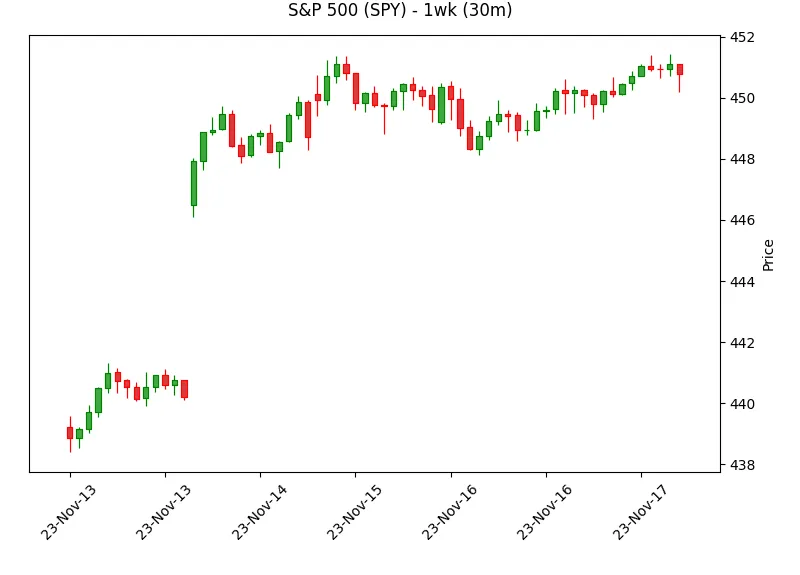

=== "1Q"

    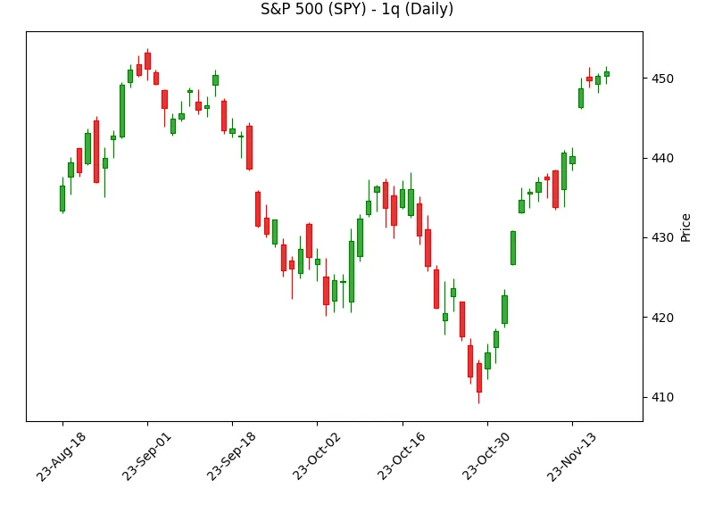

=== "1Y"

    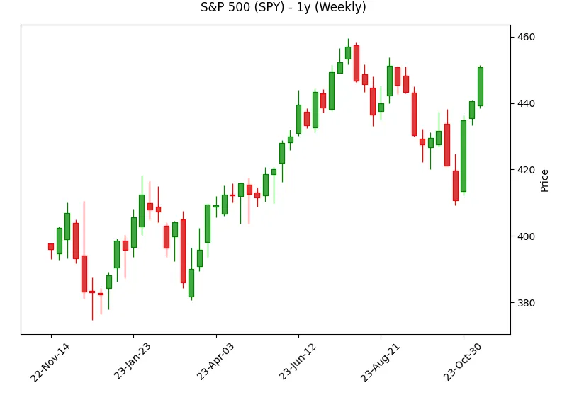

=== "5Y"

    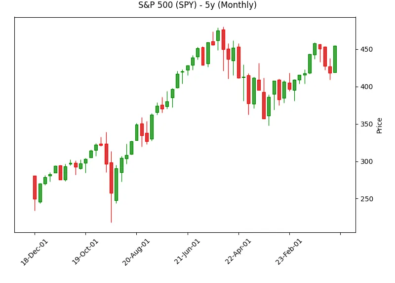

### QQQ

=== "1WK"

    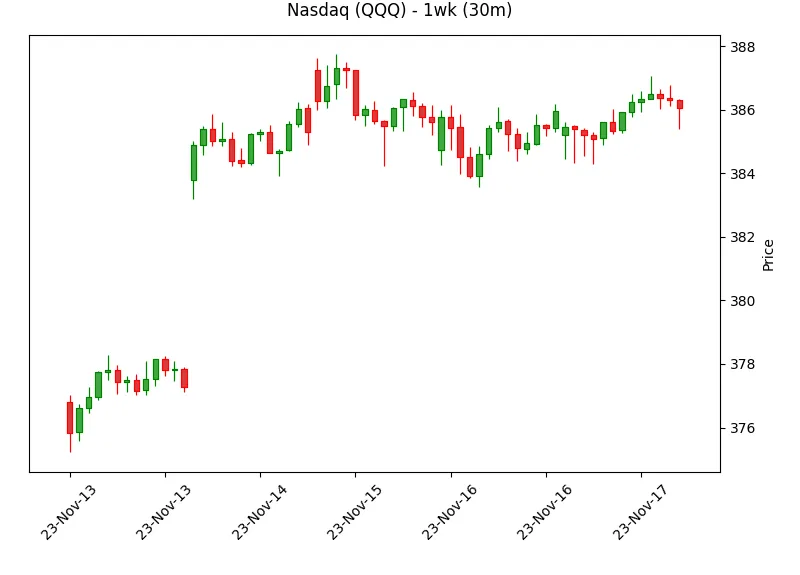

=== "1Q"

    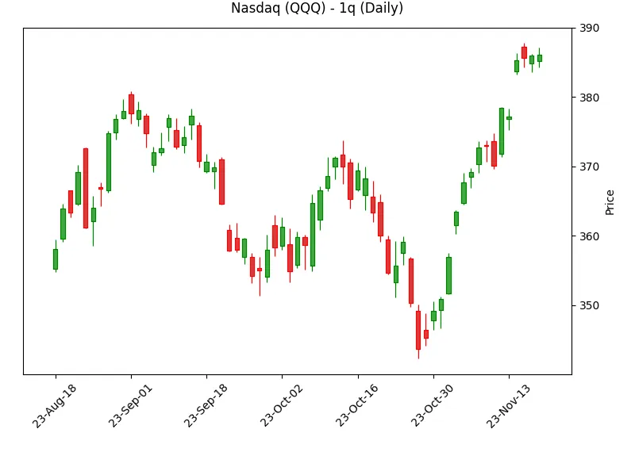

=== "1Y"

    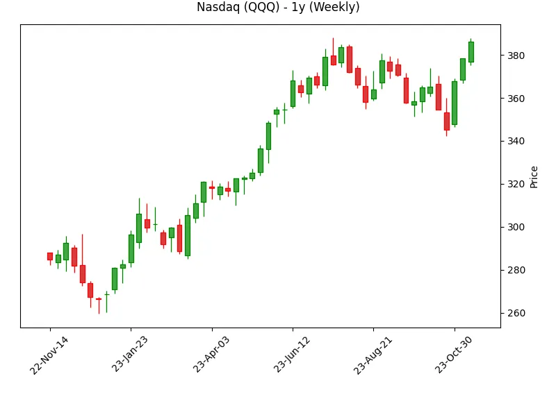

=== "5Y"

    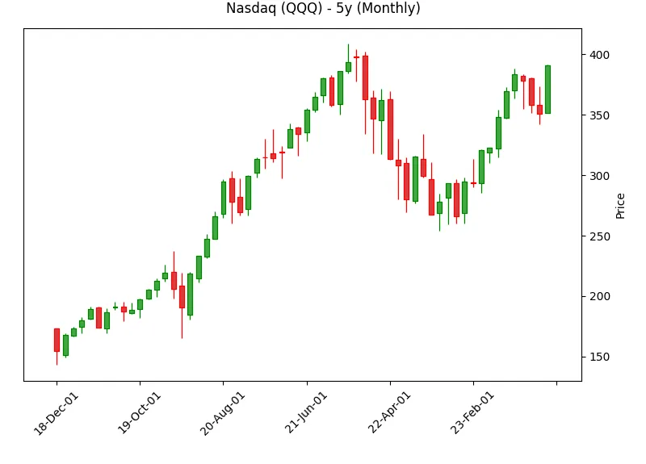

### DIA

=== "1WK"

    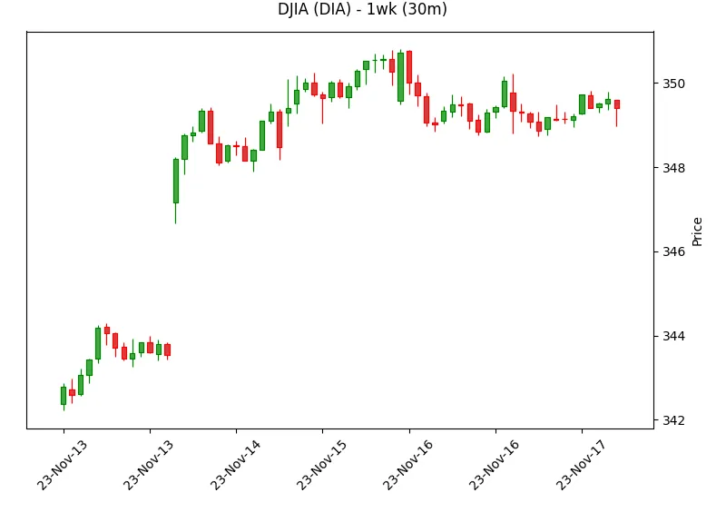

=== "1Q"

    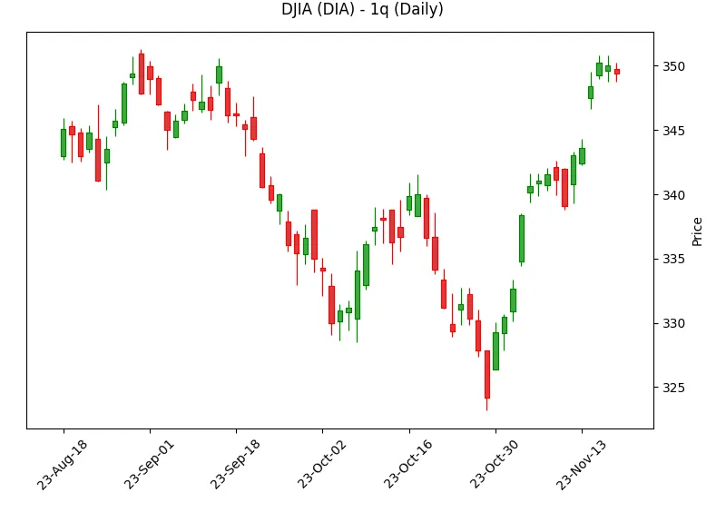

=== "1Y"

    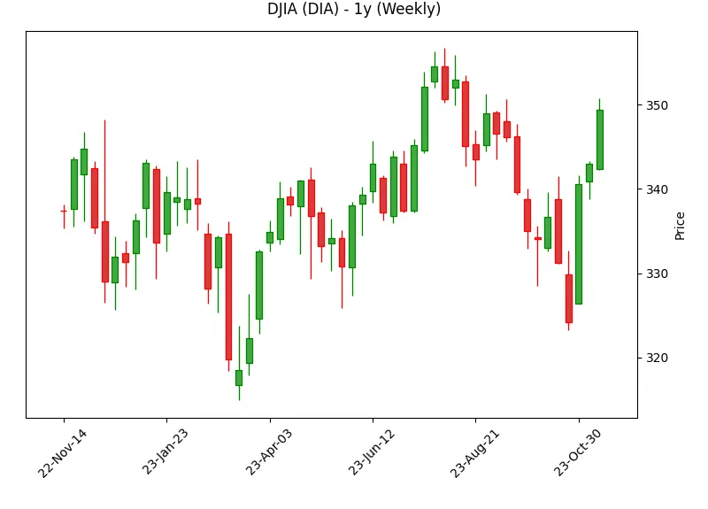

=== "5Y"

    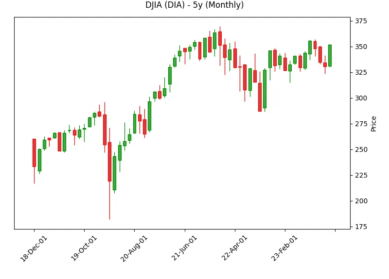

### IWM

=== "1WK"

    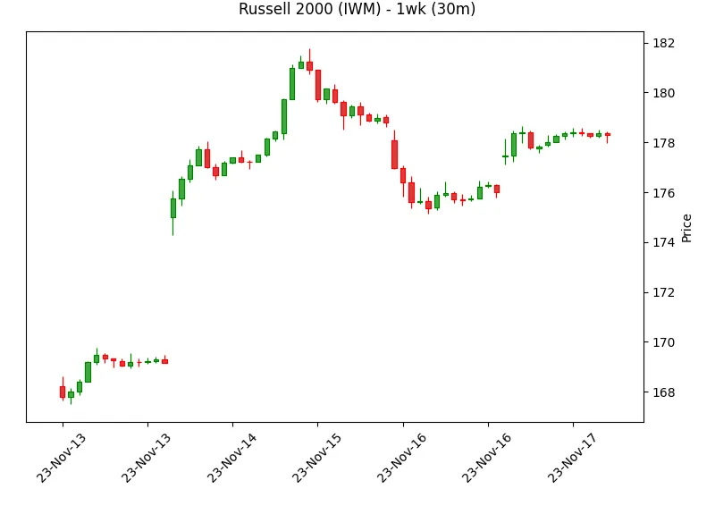

=== "1Q"

    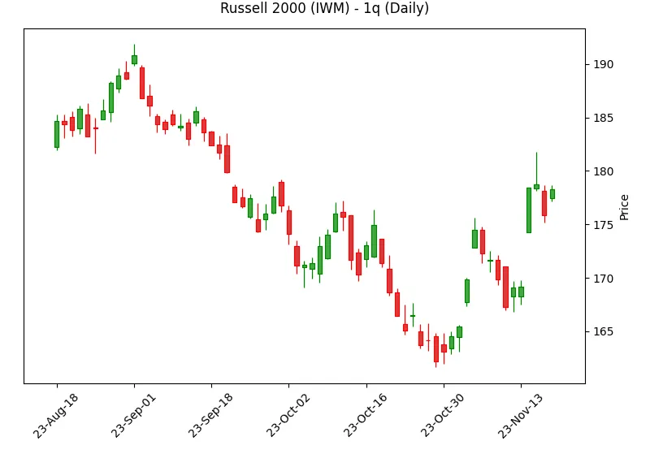

=== "1Y"

    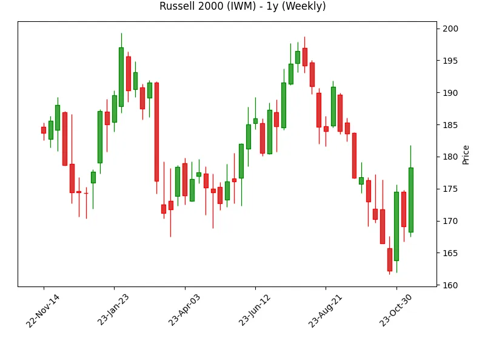

=== "5Y"

    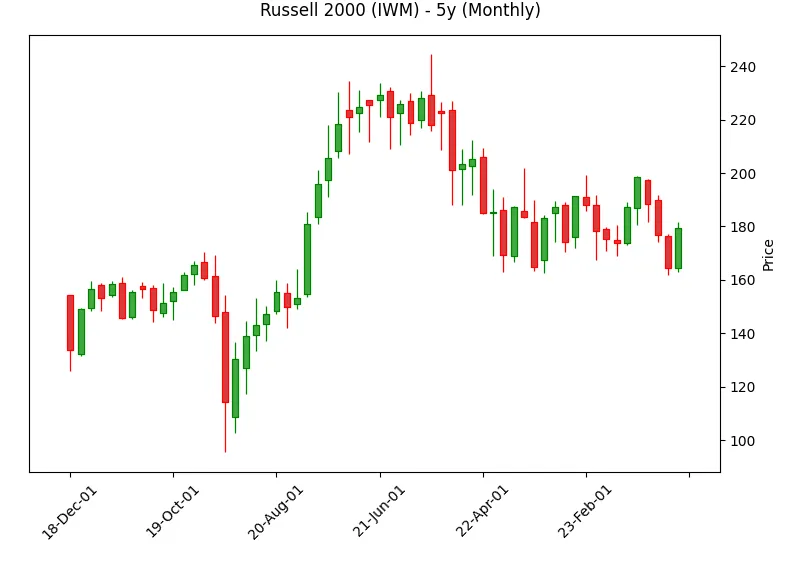

