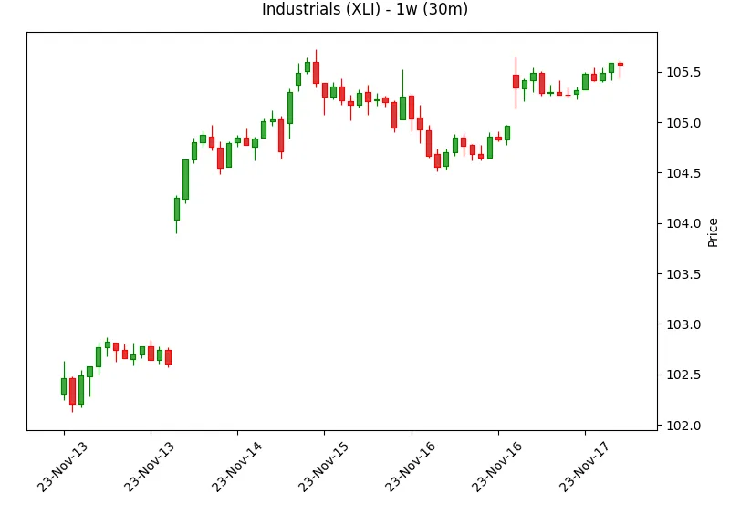
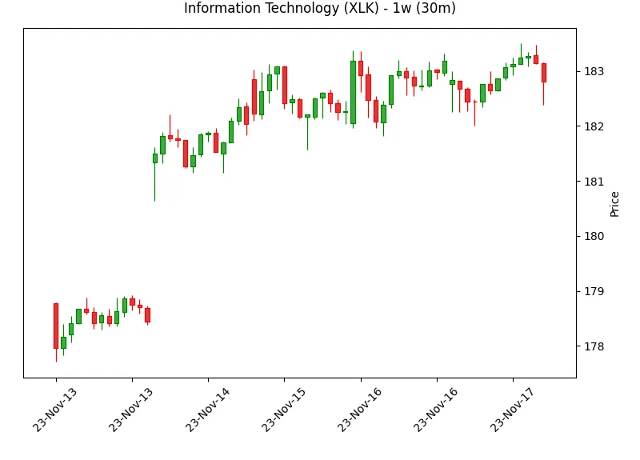
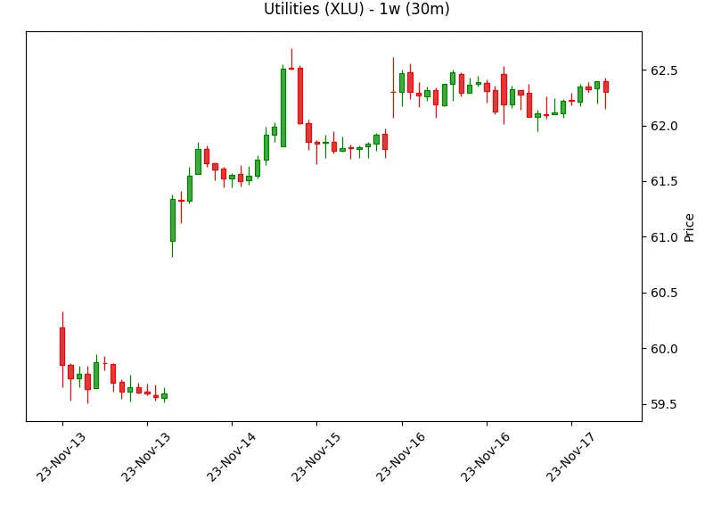

---
date:
  created: 2023-11-17
categories:
  - Sectors
authors:
  - ben
---

# Sectors - 2023-11-17

A summary and charts of 1 Week, QoQ, YoY and 5Y returns for XLC, XLY, XLP, XLE, XLF, XLV, XLI, XLB, XLRE, XLK, XLU.

<!-- more -->

## Returns

=== "1W"

    {{ read_csv("../../assets/outperformers/returns/23-11-17/sectors-1w.csv", floatfmt=".1%") }}

=== "1Q"

    {{ read_csv("../../assets/outperformers/returns/23-11-17/sectors-1q.csv", floatfmt=".1%") }}

=== "1Y"

    {{ read_csv("../../assets/outperformers/returns/23-11-17/sectors-1y.csv", floatfmt=".1%") }}

=== "5Y"

    {{ read_csv("../../assets/outperformers/returns/23-11-17/sectors-5y.csv", floatfmt=".1%") }}

## Charts

### XLC

=== "1W"

    

=== "1Q"

    

=== "1Y"

    

=== "5Y"

    

### XLY

=== "1W"

    

=== "1Q"

    

=== "1Y"

    

=== "5Y"

    

### XLP

=== "1W"

    

=== "1Q"

    

=== "1Y"

    

=== "5Y"

    

### XLE

=== "1W"

    

=== "1Q"

    

=== "1Y"

    

=== "5Y"

    

### XLF

=== "1W"

    

=== "1Q"

    

=== "1Y"

    

=== "5Y"

    

### XLV

=== "1W"

    

=== "1Q"

    

=== "1Y"

    

=== "5Y"

    

### XLI

=== "1W"

    

=== "1Q"

    

=== "1Y"

    

=== "5Y"

    

### XLB

=== "1W"

    

=== "1Q"

    

=== "1Y"

    

=== "5Y"

    

### XLRE

=== "1W"

    

=== "1Q"

    

=== "1Y"

    

=== "5Y"

    

### XLK

=== "1W"

    

=== "1Q"

    

=== "1Y"

    

=== "5Y"

    

### XLU

=== "1W"

    

=== "1Q"

    

=== "1Y"

    

=== "5Y"

    

